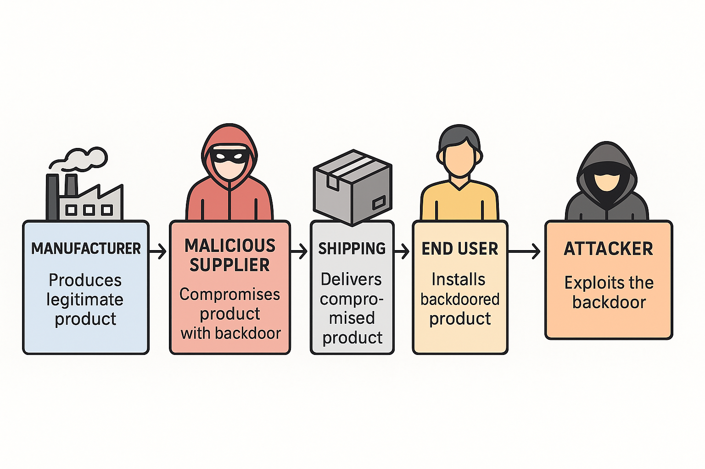

# supply_backdoor

A proof-of-concept (PoC) firmware backdoor simulation using an Arduino Nano. This project is designed to demonstrate how embedded device supply chain attacks could be used to implant hidden backdoors at the firmware level.

## Overview

This sketch emulates a router CLI (command-line interface) that includes a hidden login mechanism with EEPROM-stored credentials. Once logged in as a superuser, the device simulates familiar router environments such as Cisco IOS and MikroTik RouterOS with mock commands and outputs.

It highlights how a backdoor could be discreetly installed and triggered by known credentials post-deployment — raising awareness of the risks in the global hardware supply chain.

## Features

-  EEPROM-based credential storage for admin and superuser
-  Hidden "superuser" mode with elevated access
-  Simulated CLI with:
  - Cisco commands: `show version`, `show interfaces`, `show running-config`, `ping`, `traceroute`, `copy running-config tftp`, `reload`
  - MikroTik-style commands: `interface print`, `export`, `/tool ping`, `/tool traceroute`
-  LED "L" indicator lights up when superuser is logged in  (D13)
-  Simulates router shell environment using Serial Monitor

## Demonstrated Threat Vectors

This simulation showcases how attackers could:

- Embed malicious firmware during device manufacturing
- Use EEPROM to retain credentials post-reset
- Mimic legitimate network device interfaces to avoid suspicion

## Who Is This For?

This project is ideal for:

-  **Red Team Operators** – Demonstrating physical-layer persistence during hardware implants
-  **CTF Designers** – Creating realistic hardware or forensic challenges
-  **Pentesters & Security Researchers** – Testing awareness of supply chain and firmware security
-  **Educators** – Teaching embedded security, EEPROM, and threat modeling

## Real-World Implications

Such backdoors could be silently integrated into:

-  Mobile Phones
-  IoT, gateways and consumer routers
-  Satellite uplinks
-  Military hardware (e.g. tactical routers, encrypted comms)
-  Industrial controllers (SCADA/PLC)
-  Police bodycams or vehicle equipment

## How to Use

1. Flash `supply_backdoor.ino` to an Arduino Nano (ATmega328P).
2. Open the Serial Monitor (9600 baud).
3. Type `superuser` or `admin` when prompted.
4. Enter password (pre-programmed with EEPROM setup sketch).
5. Interact with the simulated shell.

## Setup

Run `setup_backdoor_eeprom.ino` first to set EEPROM values:
- Superuser: `superuser / password: h@rdcoded`
- Admin: `admin / password: 1234`

## Superuser-Only Commands

The following commands are **exclusive to superuser access** and are not available to regular admin users:

| Command                          | Description                                              |
|----------------------------------|----------------------------------------------------------|
| `change admin password`          | Overwrite the stored admin password via EEPROM          |
| `copy running-config tftp`       | Simulate data exfiltration via TFTP transfer            |
| `reload` / `system reboot`       | Simulate rebooting the device                           |
| `show logging`                  | Show simulated device logs (hidden from admin)          |
| `show tech-support`             | Dump simulated tech support info                        |
| `/tool traceroute`              | Extended diagnostics (MikroTik style)                   |
| `/tool ping`                    | Extended ping with fake latency feedback                |
| `export` (MikroTik style)       | Simulated full router config export                     |

Admin users are limited to basic `show version`, `show interfaces`, and `ping`.

## Files

- `supply_backdoor.ino` – Main backdoor simulation
- `setup_backdoor_eeprom.ino` – EEPROM initializer for credentials

## Educational Use Only

This code is intended **only for research, educational, and awareness purposes**. Do not deploy on unauthorized systems.

---

### Inspired by real-world threats, this demo helps visualize what firmware supply chain compromises might look like in practice.
